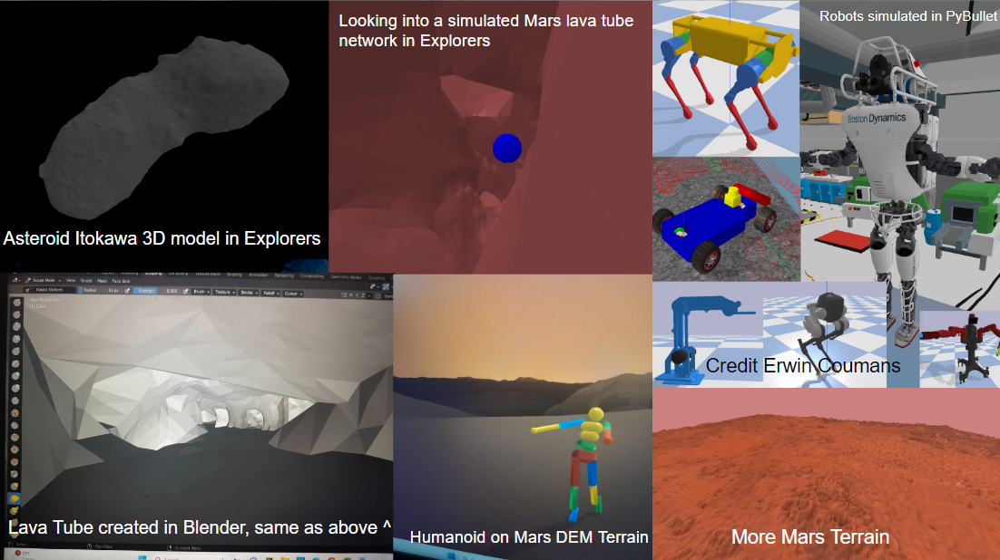
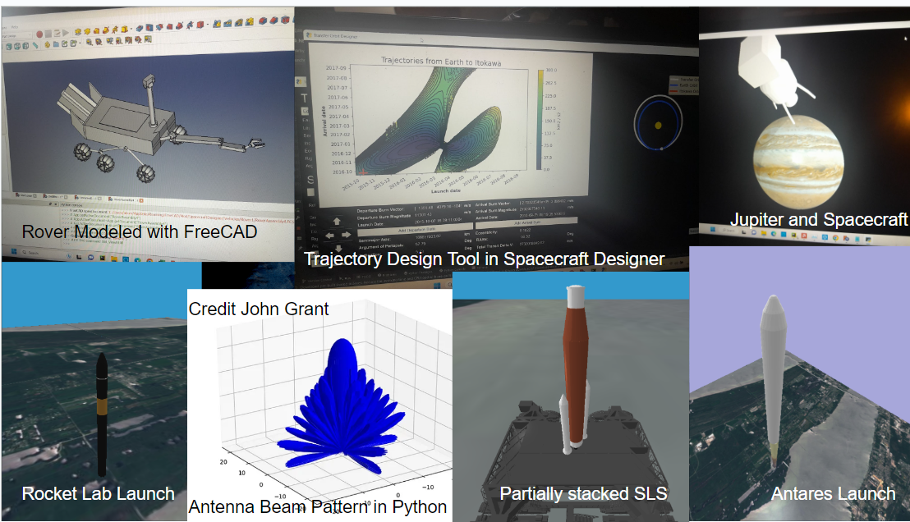
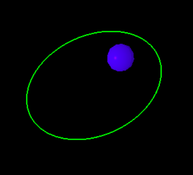
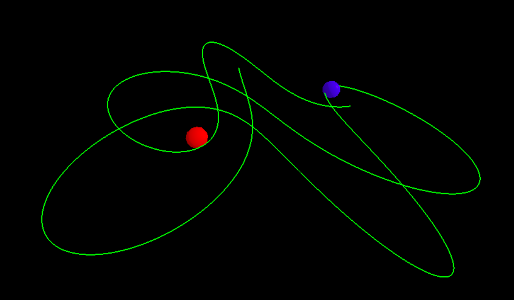

# Explorers

### Explorers and Spacecraft Designer aim to be the most accurate, complete and user friendly open-source spacecraft design and simulation tools available. Key areas and focuses of this project include creating user-friendly tools for:

##### - Spacecraft mission design and trajectory plotting
##### - Terrain modeling and landing site selection
##### - Launch vehicle selection
##### - Spacecraft guidance, navigation and control studies
##### - Mechanical design studies using FreeCAD
##### - Space environment modeling
##### - Spacecraft thermal modeling
##### - Communications system design and modeling
##### - Instrumentation design and modeling

This project is under construction, so bring your hard hat, or just your brain! There is a lot to do!

Here are some examples of existing functions/scripts!

Orbit created around a single body in a 3 body system

Visit the website at https://www.theexplorersproject.com/

Check out the documentation here!
https://docs.google.com/document/d/17-0f0Di_PyV1-UBev-qz00vglF6IMoDuzYaq7braegs/edit?usp=sharing
